# 디자인 문서: Immersive UX Overhaul

## 개요

GoJapan 앱의 쉐도잉 플레이 화면, 홈 화면, 피드백 시스템을 전면 개선하여 "속도감 있고 몰입감 있는" 학습 경험을 제공한다. 기존 아키텍처(Next.js 16, React 19, Zustand, Framer Motion, Tailwind CSS 4)를 유지하면서 애니메이션 타이밍 최적화, 네비게이션 단축, 마이크로 인터랙션 추가를 수행한다.

### 핵심 설계 원칙

1. **속도감 우선**: 모든 전환은 200ms 이내, 사용자 입력 응답은 100ms 이내
2. **기존 구조 유지**: 새 파일 최소화, 기존 컴포넌트 확장 방식
3. **점진적 향상**: Vibration API 등 선택적 기능은 지원 여부 확인 후 적용

## 아키텍처

### 변경 범위

```mermaid
graph TD
    A[Home Screen<br/>app/page.tsx] -->|Quick Resume| B[Shadowing Play<br/>app/shadow/play/page.tsx]
    A -->|장소 선택| C[Location Client<br/>app/location/.../LocationClient.tsx]
    C -->|에피소드 선택| B
    
    B --> D[Transition System<br/>framer-motion variants]
    B --> E[Feedback System<br/>components/FeedbackIndicator.tsx]
    B --> F[Combo Counter<br/>인라인 상태]
    
    G[Progress Store<br/>store/useProgressStore.ts] --> A
    G --> B
    
    style A fill:#1e1b4b,stroke:#6366f1
    style B fill:#1e1b4b,stroke:#6366f1
    style E fill:#064e3b,stroke:#10b981
    style G fill:#1e1b4b,stroke:#6366f1
```



### 변경 파일 목록

| 파일 | 변경 유형 | 설명 |
|------|-----------|------|
| `store/useProgressStore.ts` | 수정 | 세션 상태 (lastSession) 추가 |
| `app/page.tsx` | 수정 | Quick Resume 위젯, stagger 애니메이션 개선 |
| `app/shadow/play/page.tsx` | 수정 | 전환 속도 최적화, 피드백 시스템, 콤보 카운터 |
| `lib/animations.ts` | 신규 | 공유 애니메이션 variants 정의 |
| `lib/haptics.ts` | 신규 | Vibration API 래퍼 |

## 컴포넌트 및 인터페이스

### 1. 애니메이션 시스템 (`lib/animations.ts`)

Framer Motion variants를 중앙 관리하여 일관된 전환 속도를 보장한다.

```typescript
import type { Variants, Transition } from 'framer-motion';

// 공통 spring 전환
export const snappySpring: Transition = {
  type: 'spring',
  stiffness: 400,
  damping: 30,
};

export const quickFade: Transition = {
  duration: 0.15,
};

// Phase 전환 variants
export const phaseVariants: Variants = {
  initial: { opacity: 0, y: 12, scale: 0.98 },
  animate: { opacity: 1, y: 0, scale: 1 },
  exit: { opacity: 0, y: -8, scale: 0.98 },
};

// NPC 말풍선 variants
export const bubbleVariants: Variants = {
  initial: { opacity: 0, x: -12, scale: 0.95 },
  animate: { opacity: 1, x: 0, scale: 1 },
  exit: { opacity: 0, scale: 0.9 },
};

// 선택지 stagger variants
export const choiceVariants: Variants = {
  initial: { opacity: 0, y: 8 },
  animate: (i: number) => ({
    opacity: 1,
    y: 0,
    transition: { delay: i * 0.05, ...snappySpring },
  }),
};

// 정답 펄스
export const correctPulse: Variants = {
  initial: { scale: 1 },
  animate: {
    scale: [1, 1.05, 1],
    transition: { duration: 0.3 },
  },
};

// 오답 쉐이크
export const wrongShake: Variants = {
  initial: { x: 0 },
  animate: {
    x: [-4, 4, -3, 3, -1, 0],
    transition: { duration: 0.3 },
  },
};

// 프로그레스 바 spring
export const progressSpring: Transition = {
  type: 'spring',
  stiffness: 300,
  damping: 25,
};

// 카드 목록 stagger
export const staggerContainer: Variants = {
  animate: {
    transition: { staggerChildren: 0.04 },
  },
};

export const staggerItem: Variants = {
  initial: { opacity: 0, x: -12 },
  animate: { opacity: 1, x: 0 },
};
```

**설계 결정**: 애니메이션 값을 별도 파일로 분리하여 일관성을 보장하고, 향후 튜닝 시 한 곳만 수정하면 된다.

### 2. 햅틱 피드백 (`lib/haptics.ts`)

```typescript
export function hapticSuccess(): void {
  if (typeof navigator !== 'undefined' && 'vibrate' in navigator) {
    navigator.vibrate(50);
  }
}

export function hapticError(): void {
  if (typeof navigator !== 'undefined' && 'vibrate' in navigator) {
    navigator.vibrate([50, 50, 50]);
  }
}

export function hapticTap(): void {
  if (typeof navigator !== 'undefined' && 'vibrate' in navigator) {
    navigator.vibrate(10);
  }
}
```

**설계 결정**: Vibration API 미지원 디바이스에서는 조용히 무시한다 (점진적 향상).

### 3. Quick Resume 위젯 (Home Screen 내 인라인)

`app/page.tsx`에 인라인으로 구현한다. 별도 컴포넌트 파일을 만들지 않는다.

```typescript
// Progress Store에서 가져올 세션 정보
interface LastSession {
  episodeId: string;
  turnIndex: number;
  locationId: string;
  timestamp: string; // ISO string
}
```

위젯은 다음 정보를 표시한다:
- 에피소드 제목 + 장소 이름
- 진행률 (현재 턴 / 전체 턴)
- "이어하기 →" CTA 버튼

**설계 결정**: 세션 정보가 24시간 이상 지난 경우 표시하지 않는다 (오래된 세션은 의미 없음).

### 4. 피드백 시스템 (Shadowing Play Screen 내 인라인)

정답/오답 피드백을 `app/shadow/play/page.tsx` 내에서 처리한다:

- **정답**: 선택 버튼에 `correctPulse` variant 적용 + emerald 배경 + ✓ 아이콘 + `hapticSuccess()`
- **오답**: 선택 버튼에 `wrongShake` variant 적용 + red 배경 + 정답 하이라이트 + `hapticError()`
- **NPC 반응**: 정답 시 NPC 아바타에 바운스 애니메이션

### 5. 콤보 카운터 (Shadowing Play Screen 내 인라인)

```typescript
// 플레이 컴포넌트 내부 상태
const [combo, setCombo] = useState(0);

// 정답 시: setCombo(c => c + 1)
// 오답 시: setCombo(0)
```

콤보 2 이상일 때 화면 상단에 "🔥 x3 콤보!" 형태로 표시. scale-up spring 애니메이션 적용.

### 6. 완료 화면 개선

기존 완료 화면에 추가:
- Confetti 파티클 효과 (framer-motion으로 구현, 라이브러리 추가 없음)
- 소요 시간 표시 (세션 시작 시 `Date.now()` 기록)
- 콤보 최고 기록 표시

## 데이터 모델

### Progress Store 확장

기존 `useProgressStore`에 다음 필드를 추가한다:

```typescript
// 추가 필드
interface LastSession {
  episodeId: string;
  turnIndex: number;
  locationId: string;
  timestamp: string;
}

interface ProgressState {
  // ... 기존 필드 유지 ...
  lastSession: LastSession | null;

  // 추가 액션
  saveSession: (episodeId: string, turnIndex: number, locationId: string) => void;
  clearSession: () => void;
}
```

### 세션 저장 로직

```typescript
saveSession: (episodeId, turnIndex, locationId) =>
  set({
    lastSession: {
      episodeId,
      turnIndex,
      locationId,
      timestamp: new Date().toISOString(),
    },
  }),

clearSession: () => set({ lastSession: null }),
```

Zustand의 `persist` 미들웨어가 이미 적용되어 있으므로 `lastSession`은 자동으로 localStorage에 저장된다.

### 세션 유효성 판단

```typescript
function isSessionValid(session: LastSession | null): boolean {
  if (!session) return false;
  const age = Date.now() - new Date(session.timestamp).getTime();
  return age < 24 * 60 * 60 * 1000; // 24시간 이내
}
```


## 정확성 속성 (Correctness Properties)

*속성(property)이란 시스템의 모든 유효한 실행에서 참이어야 하는 특성 또는 동작이다. 속성은 사람이 읽을 수 있는 명세와 기계가 검증할 수 있는 정확성 보장 사이의 다리 역할을 한다.*

### Property 1: Quick Resume 데이터 완전성 및 네비게이션

*For any* 유효한 lastSession (episodeId, turnIndex, locationId, timestamp), Quick Resume 위젯 데이터를 구성하면 에피소드 제목, 장소 이름, 진행률 정보가 모두 포함되어야 하고, 생성된 네비게이션 URL은 `/shadow/play?ep={episodeId}` 형식이어야 한다.

**Validates: Requirements 2.2, 2.5**

### Property 2: 첫 번째 미완료 에피소드 탐색

*For any* 장소의 에피소드 목록과 완료된 에피소드 ID 집합에 대해, 첫 번째 미완료 에피소드를 찾는 함수는 목록 순서상 가장 앞에 있는 미완료 에피소드를 반환해야 한다. 모든 에피소드가 완료된 경우 null을 반환해야 한다.

**Validates: Requirements 2.3**

### Property 3: 오답 시 정답 식별

*For any* 선택지 배열(choices)에서 오답을 선택했을 때, 시스템은 `correct: true`인 선택지를 정확히 하나 식별하여 하이라이트 대상으로 반환해야 한다.

**Validates: Requirements 3.3**

### Property 4: 진행률 계산 정확성

*For any* 턴 인덱스(0 이상)와 전체 턴 수(1 이상)에 대해, 진행률 퍼센트는 `(turnIndex + 1) / totalTurns * 100`과 동일해야 하며, 결과는 항상 0 초과 100 이하여야 한다.

**Validates: Requirements 4.1**

### Property 5: 에피소드 완료 요약 데이터 완전성

*For any* 에피소드 완료 상태(학습 단어 수, 잔여 HP, 시작 시간)에 대해, 요약 데이터를 구성하면 단어 수(0 이상), HP(0 이상 MAX_HP 이하), 소요 시간(0 이상)이 모두 포함되어야 한다.

**Validates: Requirements 4.3**

### Property 6: 콤보 카운터 스트릭 로직

*For any* 정답/오답 시퀀스에 대해, 콤보 카운터는 현재 연속 정답 수와 동일해야 한다. 오답이 발생하면 카운터는 0으로 리셋되어야 한다.

**Validates: Requirements 4.4**

### Property 7: 세션 저장/복원 라운드 트립

*For any* 유효한 에피소드 ID, 턴 인덱스, 장소 ID에 대해, `saveSession`으로 저장한 후 `lastSession`을 읽으면 동일한 에피소드 ID와 턴 인덱스를 반환해야 한다.

**Validates: Requirements 6.1, 6.2, 6.4**

### Property 8: 세션 초기화

*For any* 저장된 세션 상태에 대해, `clearSession`을 호출하면 `lastSession`은 null이어야 한다.

**Validates: Requirements 6.3**

## 에러 처리

### 세션 복원 실패

- `lastSession`의 `episodeId`가 더 이상 존재하지 않는 에피소드를 참조하는 경우, Quick Resume 위젯을 표시하지 않고 세션을 자동 초기화한다.
- `turnIndex`가 에피소드의 전체 턴 수를 초과하는 경우, 에피소드 처음부터 시작한다.

### Vibration API 미지원

- `navigator.vibrate`가 없는 환경에서는 햅틱 함수가 조용히 무시된다 (no-op).
- 에러를 throw하지 않는다.

### 에피소드 데이터 로딩 실패

- Supabase에서 생성된 에피소드 로딩 실패 시, 기존 로딩 스피너를 유지하고 정적 에피소드만 표시한다.
- Quick Resume 위젯에서 참조하는 에피소드가 로딩 실패한 경우, 위젯을 숨긴다.

### 애니메이션 성능 저하

- 저사양 디바이스에서 framer-motion 애니메이션이 프레임 드롭을 일으킬 경우를 대비하여, `will-change` CSS 속성을 주요 애니메이션 요소에 적용한다.
- `transform`과 `opacity`만 애니메이션하여 GPU 가속을 활용한다.

## 테스팅 전략

### 속성 기반 테스트 (Property-Based Testing)

- **라이브러리**: `fast-check` (TypeScript용 PBT 라이브러리)
- **최소 반복 횟수**: 각 속성 테스트당 100회
- **태그 형식**: `Feature: immersive-ux-overhaul, Property {번호}: {속성 제목}`

테스트 대상 순수 함수:
1. `buildResumeData(session, episodes, locations)` → Property 1
2. `findFirstIncompleteEpisode(episodes, completedIds)` → Property 2
3. `findCorrectChoice(choices)` → Property 3
4. `calculateProgress(turnIndex, totalTurns)` → Property 4
5. `buildCompletionSummary(vocabLearned, hp, startTime)` → Property 5
6. 콤보 카운터 리듀서 로직 → Property 6
7. `saveSession` / `lastSession` 라운드 트립 → Property 7
8. `clearSession` → Property 8

### 단위 테스트 (Unit Testing)

- **라이브러리**: `vitest`
- 테스트 대상:
  - 햅틱 함수가 올바른 진동 패턴으로 호출되는지 (mock navigator.vibrate)
  - 세션 유효성 판단 (24시간 경계값)
  - Quick Resume 위젯이 세션 없을 때 렌더링되지 않는지
  - 애니메이션 variants 객체의 구조 검증

### 테스트 균형

- 속성 테스트: 순수 로직 함수의 보편적 정확성 검증 (8개 속성)
- 단위 테스트: 특정 예제, 경계값, 에러 조건 검증
- 두 접근법은 상호 보완적이며 모두 필요하다
